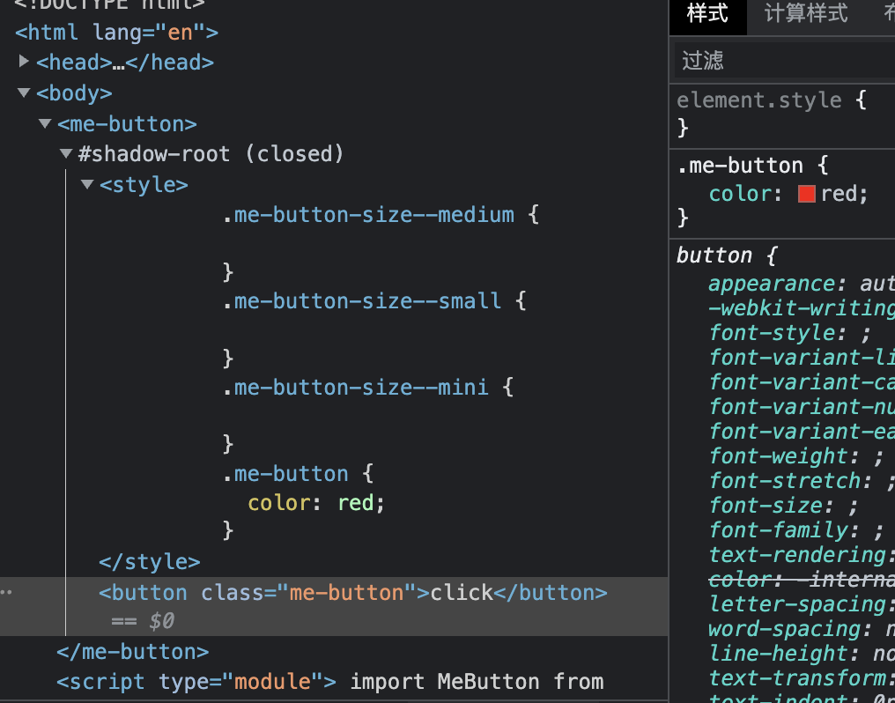

# WebCompNative
WebComponent 原生开发

参照ElementUI的button组件写一个 WebComponent

| 参数 | 说明 | 类型   | 可选值            | 默认值 |
| ---- | ---- | ------ | ----------------- | ------ |
| size | 尺寸 | string | medium/small/mini | ---    |


# WebComponent 开发注意

原生开发的时候 html 代码都以字符串的形式存在，不方便。 可以安装插件 [innerHTML Syntax Highlighting](https://marketplace.visualstudio.com/items?itemName=nicolasparada.innerhtml)

原生组件的开发可以参考这个： [MDN WebComponent examples](https://github.com/mdn/web-components-examples)

## 需要使用 shadow dom
shadow dom 的用途是隔离不同组件之间的样式，下面的代码没有用到 shadow dom，是不符合 WebComponent 实用要求的。

**attachShadow 时 mode 的作用**
事件对象中存在一个属性为 composedPath， 他会返回一个 EventTarget 对象数组， 也就是 DOM  数组。

mode：open
```javascript
Array [ p, ShadowRoot, open-shadow, body, html, HTMLDocument https://mdn.github.io/web-components-examples/composed-composed-path/, Window ]
```

mode: closed
```javascript

Array [ closed-shadow, body, html, HTMLDocument https://mdn.github.io/web-components-examples/composed-composed-path/, Window ]
```

closed 状态下的时候， 事件只会传播到 customoElement 而不会影响到影子边界内的节点。

```javascript
export default class MeButton extends HTMLElement {
  constructor() {
    super();

    const template = document.createElement("template");
    template.innerHTML = `
      <button class="me-button">click</button>
    `;
    this.appendChild(template.content);
  }
}

if (!window.customElements.get("me-button")) {
  window.customElements.define("me-button", MeButton);
}
```

下面这样的代码才是比较好的

```javascript
export default class MeButton extends HTMLElement {
  constructor() {
    super();

    const template = document.createElement("template");
    template.innerHTML = `
      <style>
        .me-button {
          color: red;
        }
      </style>
      <button class="me-button">click</button>
    `;
    const shadowRoot = this.attachShadow({
      mode: "closed",
    });

    shadowRoot.appendChild(template.content);
  }
}

if (!window.customElements.get("me-button")) {
  window.customElements.define("me-button", MeButton);
}

```


## :defined 伪类

表示任何已定义的元素。这包括任何浏览器内置的标准元素以及已成功定义的自定义元素


## 属性的获取

在原生的 WebComponent 中，我们使用 getter 来接收并处理属性

**注意：**
1. 和Vue中的 computed 类似，在组件内部没有对size属性发生引用的时候，其内部的代码并不会执行。
2. 并且这个属性并不是响应式的，在外部修改 dom 的 attribute的时候，getter 函数并不会再次执行，视图也不会改变。

```javascript
sizeRules = ["mini", "small", "medium"];

get size() {
    const size = this.getAttribute("size");
    if (!this.sizeRules.includes(size) && size.length) {
        throw new Error(`${size} is not in ${this.sizeRules}`);
    }
    return size || "medium";
}
```

## 根据传递的属性初始化元素

比如，要根据 `me-button` 元素上的 `size` 属性，为组件添加不同的类名。
注意：这个类名不会添加在组件外层，而是添加在 `template` 模板中，位于 `shadow dom` 里面。

直接将类名写在 `constructor` 中写在 `template`  上即可， `constructor` 函数执行时是可以访问 `getter` 的。


